# Process Journal

## Tiny Game | 23/01/2025
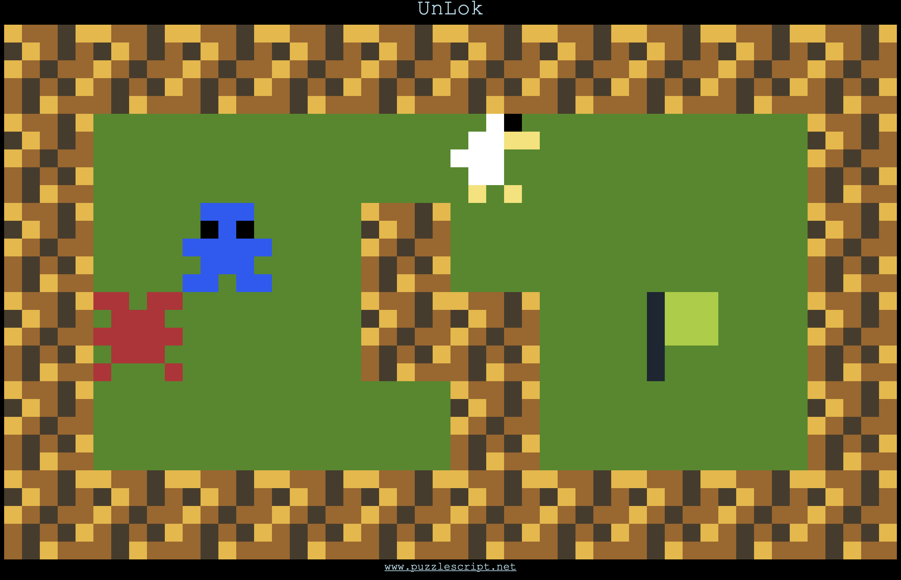

[Game Link](../Projects/UnLok.html)

### Thoughts:
- I decided to do a puzzle game with puzzle script engine since I found the game "bloom" very enjoyable to mess around with
- I somehow managed to make the editor stop working
- It turned out to be some syntax bug with words not capitalized 
- I used the game's documentation and took some commands from there to create the basic puzzle idea
- Then I just started messing around with making levels using the mechanics
- Added the mole and had a lot of difficulty setting it up since you couldn't pass through it without killing you
- Decided that the mole moves similarly to the player to make for a more interesting obstacle
- Found that moving into walls was the dominant strategy to solve most puzzles and invalidated the mole's challenge often 
- Added spikes to make this way more challenging
- The mole could delete not only enemies but also the win flag
- So I used this as the gimmick for the final level
- The later levels with the mole onwards are buggy and not well balanced

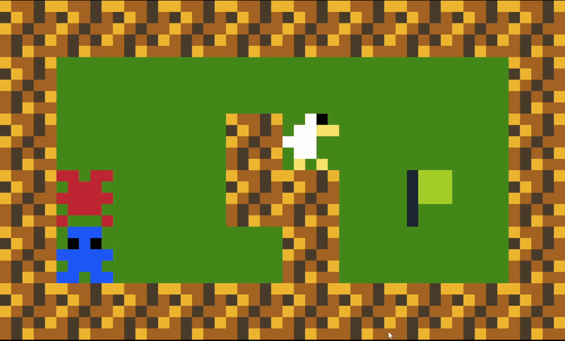

### Playtest notes: 
- everyone liked the game and found it very challenging
- Someone who likes puzzle games specifically really enjoyed it

## Exploration Prototype 1
- I forgot to work on this. I think that my goals going forward will be to not forget again and mess around to find something interesting to turn the prototype into. 

## Exploration Prototype 2

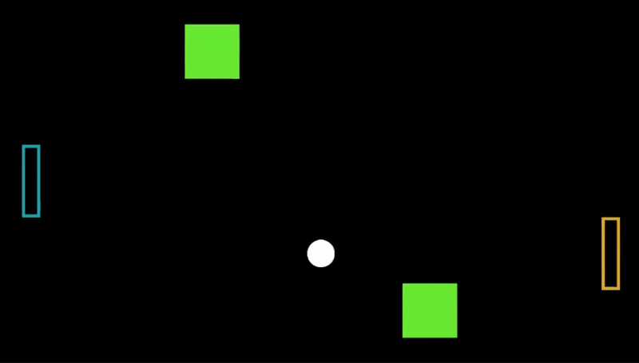

- Starting with the pong template
- Modified the paddle's movement to scale to time passed (delta time)
- Thinking about the game "Cube Slam" and how it made pong fun and interesting. Might steal some ideas from it
- I made a new script for an AI paddle opponent that simply follows where the ball goes. This would mimic "Cube Slam"'s opponent.
- Next I started implementing moving walls. There was trouble when on start, it kept placing the object at the orgin instead of where I defined it.
- After some detective work, I found that my code was reseting the position to (0,0,0) on the first frame because the initial x and y position that were being used in the transform were starting at 0.
- I added variable angles to when the ball bounces off the paddles. It took a lot of math to figure out what exactly I wanted. 
- Basically, I wanted the balls to travel at an angle based on where it bounced on the paddle. So I would take the distance between the ball's y and the paddle's y and combine them together to get the steepness of our new tragectory 'a'. That would fit into the formula y=ax. Then I also wanted to make sure that the velocity was consistent at said angles. So I said that s=x+y, 's' being the ball speed. Eventually, I formulated formulas to find 'x' and 'y' coordinates that would satify both with x = s/(a+1) and y = (a*s)/(a+1). 
- After all the math, I got something that worked somewhat. I thinks it didn't exacly turn out how I thought it would. But it still works nicely to control the ball's angle. Which was the end goal. So at this point I'm satisfied with the result.
- I wanted to add text displaying the score as the finishing touch but I think that would a bit much here.
- I'm not sure what else I would want to add except maybe more levels with different wall variations? The wall movement is definitely flexible enough for something like that.

## Exploration Prototype 3
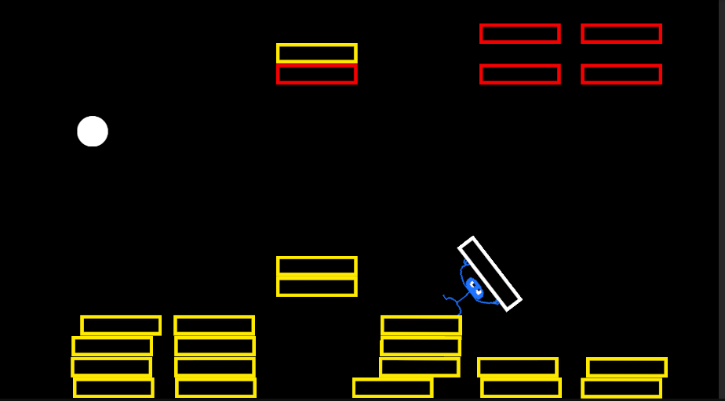

- I had this idea to take the breakout blocks and make them fall and stack when hit
- My next thought would be how would the ball fall out of bounds if the fallen bricks stopped them? So I decided there should be another fail condition like a time limit to hit all the other blocks. 
- I then imagined that you would be able to platform on top of the falling blocks. So I created paddle guy.
- I gave him unique collision and gave him a jump. The physics were strange and would knock himself over. But instead of locking the rotation, I imagine that it would be more interesting to have a backwards jump to reposition yourself instead.
- The bricks have been modified into "fall bricks". When the ball hits them, their physics activate, they fall to the ground and change color.
- I used the game manager to track how many bricks we need to hit to win the game and how many bricks have been hit to create a win condidion.
- Once you win, you get the total time in seconds passed as your high score. Now the game is a time trial to compete against other's high scores.

## Exploration Prototype 3 - Continued


- If the question behind the first part of this prototype was "how can I make breakout with falling blocks?", my next question is "How can I make the mechanics more interesting".
- Once the blocks fall, they act as platforms. However, the player can basically fly and blow right through them. 
- I modified the bricks so that they have more mass and move around less when pushed by the player. I also got rid of the paddle guy's backwards jump because it was not only un-intuitive, without it the player has to work to flip the paddle right side up in order to use their jump ability again, adding depth.
- I gave the paddle guy's jump a cooldown so that you can no longer fly around. The paddle guy's color darkens to show when the jump is on cooldown.
- I added some simple ui to show the timer that tracks how long it took to beat the level. I also put a goal time. This would keep the high score mechanic while also creating an initial challenge to beat.
- Also added a simple out of bounds checker for the ball. If its traveling somewhere too far out of the game, it will reset.
- I found that it was too easy to fall over and too difficult to put yourself upright. So I added buttons that can rotate the paddle guy left and right. The paddle guy also now has more detailed collision, making him a bit harder to keep upright.
- When the game starts, you can jump into the ball and mess up everything before pressing space to launch it. So I made it that the paddle guy can't jump before space is pressed. The timer also doesn't start until the ball launches.

## Iterative Prototype 1


### Brain Dump
"I want to make a racing game"
cars, f-1, time trials, race tracks, maps, environments, racers, custimization, engines, speed, crashing, items, stats, velocity, steering, karts, destruction, multiplayer, guard rails, control, drift, boost, nitro, stamina, characters, trails, shortcuts, environments, fast-paced decisions, realism, difficulty, obstacles, speed boosts, mud pits, trees, metal, steel, tires, plains, traversal, competition, grandprix, placement, finish line, start line, prizes, standings, rankings, directions, comeback mechanics, collision, aesthetic, personalization
### Hybrids
*Note: I wrote down ideas based on combinations of words but didn't write the combos. For the 3 I chose, I happen to remember what combinations created those ideas.
- Racing with trails that otheres race on
- Traversing forests/offroading
- Fully customizable racing machines you build as you race
- Drifting focused on highscores
- Race track that encourages decision making with split paths
### Speed Dating
- Nitro that destroys cars
- Cathedral themed racing game
- Low ranking racers get a chance at redemption
- Racing rats inside walls of house
- Racing rhythm game
- Race where you crawl with stamina system
- Flying in free-fall with boosts
- Guiding car with bouncy guard rails
- Rabbit hole shortcuts
- Diving into subjects through racing
- Racing across the sun
- Robot on moon racing
- Goth kart
- Hell highway (very fast, racing through layers of hell)

### Refining ideas
- I think the design values of my game will mainly be surrounding decision making, theme and challenge. I want to make a game that encourages the player that encourages interesting decision making. The right option shouldn't obvious and there should be nuance to choices made. I think themes can help tie together the feel of a game so I would like a strong visual theme. Challenge I believe makes the experience more engaging for players. So I will make sure to find the balance that suits the game the most.
- As for my 3 favorite ideas that came about from the ideation, they are:
1. Racing Rats: A game where you race as rats climbing through the walls and furniture of a house.
2. Near Infinite Guard Rails: Guiding a racer with bouncing rails or simply a guiding path that the player creates.
3. Crawl Stamina: A stamina managing game where you have to crawl around.

### Testing An Idea - Physical Prototype
- To make a prototype, I decided to test out the idea for near infinite guard rails.
- The game is to use guard rails to guide a marble from the top of the board to the bottom while avoiding the pitfalls and landing inside the marked hole at the bottom.
- The user would drop the marble at the gap from the top and it would roll down due to gravity and the angle of the board.
- The challenge here is to guide the marble safely to its goal while making sure it falls into the correct hole.


- The holes allow the ball to drop into the inside of the box where it can be retrived easily.


## Iterative Prototype 2
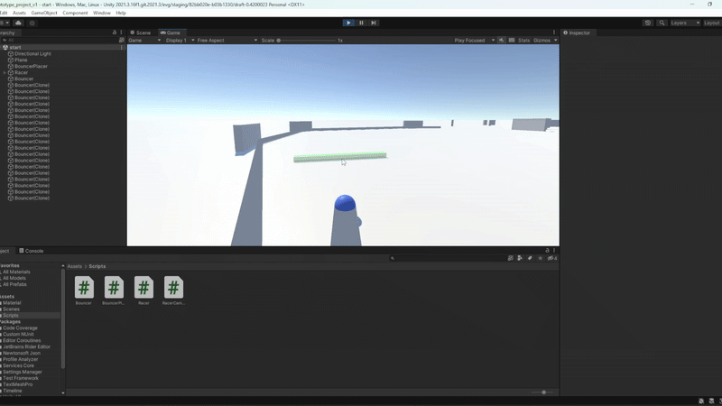

### Question
- Is controlling a racer with guard rails feasible for the player?
### Implementation
- After seing that controlling a marble through guard rails could be fun, I decided to apply it to my racing game concept
- I made a unity 3d project where you control a marble like racer that can only move forwards
- I worked on a camera that could follow it smoothly even if it changed direction
- This ended up taking a lot of time to figure something out that was functional and looked fluid
- I wanted the camera to smoothly trail behind the racer as it turns and changes direction
- I couldn't figure out a solution so the best I could get was simply snaping the camera to the direction the racer was heading towards
- Then after testing with static walls to bounce the racer, I made a wall placer
- The player's cursor can place walls to bounce the racer around
### Reflection
- It was much more difficult to manage the camera than I had imagined

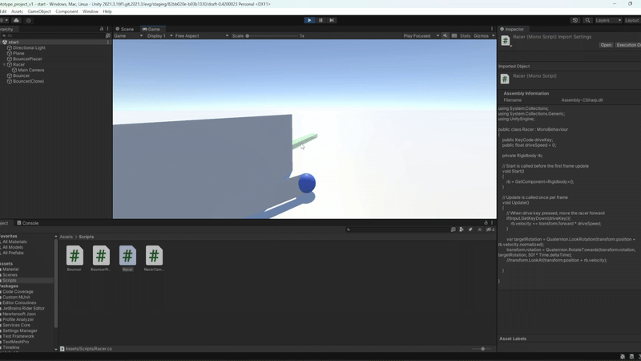

- I suppose what I was looking for was maybe too specific even though there were many instances where I got close
- Suprisingly, even with the stiff camera, the game is pretty easy to handle
- I do think that a smoother camera would be better for a more robust iteration
- I also didn't spend much time looking at what happens when velocity is added while the racer is moving and could be fixed in a later iteration
- Overall I think that this idea has way more potential than I initially imagined

## Iterative Prototype 3

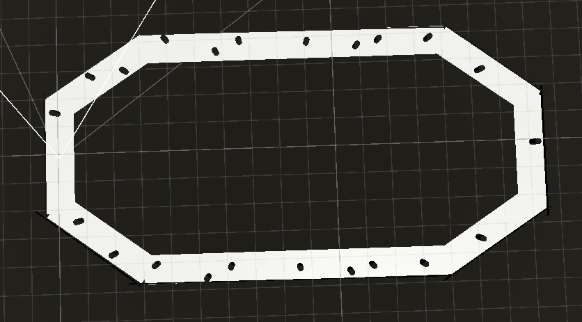

### Question
- How can I make a playable racing game from my previous tests?

### Implementation
- I started by making a race track
- To fix the camera, by the advice of a fellow classmate, I decided to check out cinemachine
- I then decided to add obstacles to the race track to make it more dangerous to complete
    - I put walls to stop the player from escaping
    - A kill floor for if the player falls out of bounds
    - Pillars that are on track obstacles
    - Wind that moves the racer around

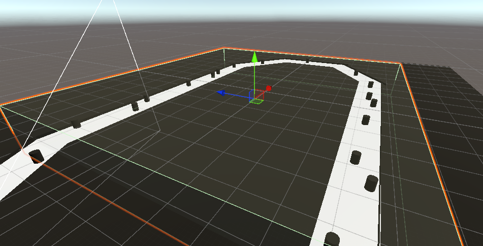

*The windbox on the race track*

### Reflection
- Design Principles 
    - When it comes to my design principles, I do think that while there is challenge, it is not neccessarily there yet 
    - Perhaps more obstacles closer together could accomplish this?
- Bugs
    - The camera is still causing problems despite the new cinemachine camera being a definite upgrade
    - I did have to do some strange code in order to make sure that the ball doesn't bounce too much 
    ```
        rb.velocity = new Vector3(rb.velocity.x, rb.velocity.y * 0.95f, rb.velocity.z);
    ```
    - I'm hoping this code doesn't cause too much trouble if I ever decide to add trickier terrain
- Overall
    - Things are really starting to get fleshed out 
    - The idea of a racing game seems more and more possible


*Camera jitters and wind effect*

### Ideas for next iteration
- Visuals
    - I think I could possible prototype some visuals for the game
    - Adding a completely new and more complex race track
    - Changing the racer's model
    - UI elements
- Balance
    - Some balance adjustments to the difficulty
    - New types of obstacles for the track
- Features
    - Making a working lap counter
    - Adding a win and lose condition
   
### Feedback
- Players thoughts
  - The camera was a not ideal and shoudle be positioned higher
  - They like the unique movement but felt like instead of just completing a race they should have the ability to explore an environment of some kind
  - Another idea was creating something as you travel. Something building in your trail that you can maybe look back upon and enjoy
- My thoughts on the feedback
  - I also wanted the camera to be fixed that way but I thought that the way I implemented it before was causing extra jitters. After some research, I realise that its actually the movement of the racer that is jittery and not the camera. So finally adding this feature properly is indeed a good idea.
  - In terms of making the game more exploration oriented rather than challenge oriented, I think this is too far from the design goals for my game. This idea kind of reminds me of the game exo one. I do think I will take a bit from this idea by potentially adding a more open racetrack with more options of traversal. Maybe even a free play option to drive around without the threat of a game over.  If this was a full game, I would make the hub world for levels open like this. (think diddy kong racing) 
  
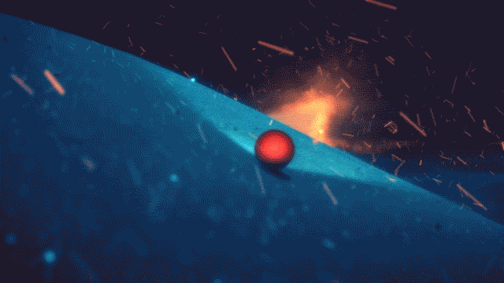
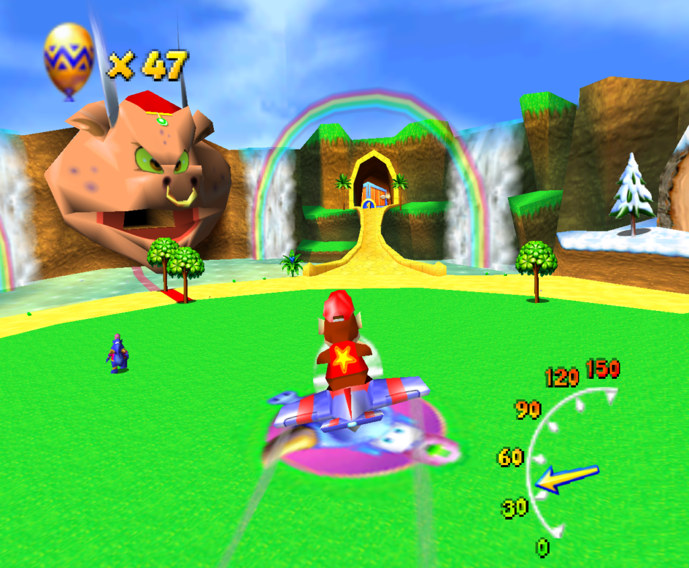

*Exo One Video Game & Diddy Kong Racing Hub World*

## Iterative Prototype 4


### Question
- How can I create interesting challenge for my game?
- Goals
  - [x] Fix camera
  - [x] Making a time trial
  - [x] Making a lose condition
  - [x] New type of obstacle
  - [x] Rework the race track layout
  - [x] UI elements
  - [x] Draft of possible visuals
  - [ ] Collectible items
  - [x] Update collision

### Implementation
- I fixed the camera angle to be offset and not have any damping when following the racer
    - *This is to make sure that the racer never moves further ahead than where you can place bumpers to guide it*
    - *It also give the player a good view of the track and racer at all times*

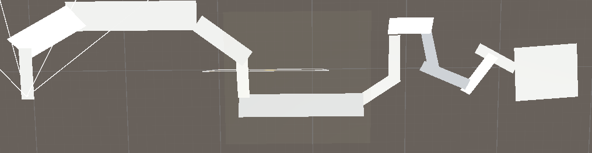

- The whole racetrack was turned from a loop to a straight track with a definite start and end
    - *This is to emphasize the time trial aspect of the game design by having a clear start and end point*
- There is now a speedometer that tracks the player's speed
    - *It helps the user keep track of how fast they are going now that the damping camera effect has been removed*
- A countdown timer starts off the time trial for the player
    - *This is to prepare the user for a race*
- I modified the collision material from the racer to the bouncer
    - *Before, extra code was needed to make gravity work but that has now bit fixed*
- The pillar enemies now move around
    - *This is to increase the challenge of the race to enforce my design goals*
- I put instructions on the display
    - *Makes it easier for players to understand how to play without me there to say it*
- I added a speed cap to the racer's y velocity
    - *This is to stop the player from flying over the entire track without engaging in the challenge*
    ```
        // Make sure we never have too much y velocity upwards
        if(rb.velocity.y > 5) {
            rb.velocity = new Vector3(rb.velocity.x, 5, rb.velocity.z);
        }
    ```
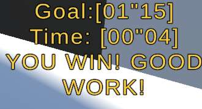

- The game now has a win screen and win/lose condition for beating the time trial
    - *The game is now a proper game with a win and lose that falls under the design goals*

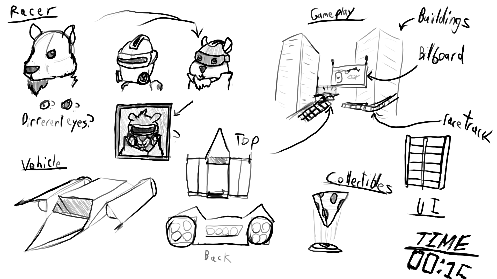

- I made a draft of what a final game might look like
    - *This is to guide the racetrack design a bit more as well as brainstorming a visual theme*
    - *The 'rat racing' theme came from one of the design ideas that came from the [initial brainstorming](#refining-ideas)*

### Reflection 
- The game now has an interesting challenge to it
- Its really starting to shape into a full protype

### Ideas for next iteration
- Visuals
    - I could turn my draft of the visuals into the real deal
- More levels
    - This is unlikely because of time constraints but more levels would make for a more varied experience
- Collectibles
    - I wasn't able to make it this iteration, but having collectibles along the racetrack could be interesting
    - They could benefit the racer in some way or be required to finish the race

## Iterative Prototype 4
- What might a finalized version look like?
- Goals
  - [x] new skybox
  - [x] building texture
  - [x] racer model
  - [ ] ui images
  - [x] road texture
  - [x] billboard texture
  - [ ] update out of bounds logic
  - [x] sound effects
  - [x] music

### Implementation


- I added a textures to the roads, buildings, billboards, and skybox
    - *all of this is to have a more final look for the game*

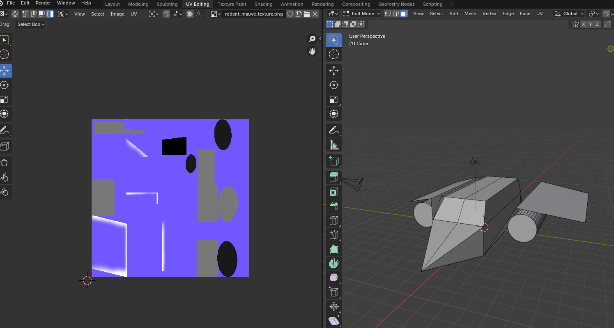

- The racer has a new model
    - *This will help to see what a bouncing race car might look like*
    - *Blender was used to model and texture the race car*

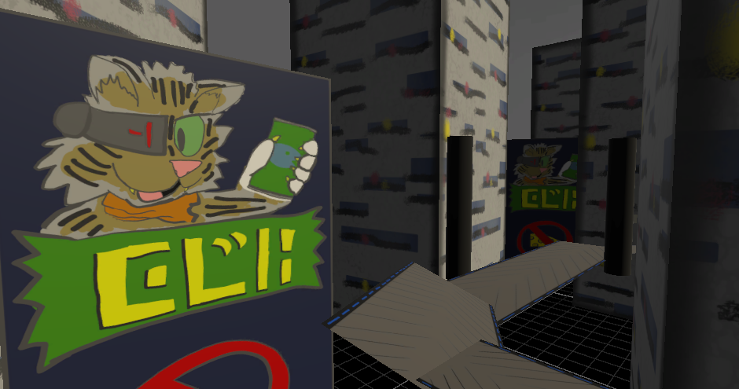

- The visual style
    - I decided on making it a f-zero inspired future racer
    - The oppresive environment helps to express the challenge that the race poses

### Credits
- Here are some of the ressources used for the sounds
    - jsfxr for crash win and bounce sounds
    - https://freesound.org/people/qubodup/sounds/187734/ for engine sounds
    - https://opengameart.org/content/zodik-future-travel for the music

### Reflection

### Ideas for next iteration  